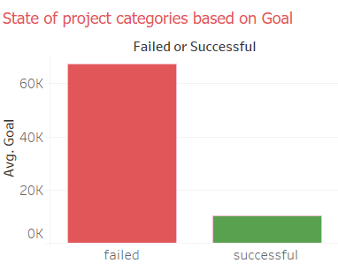
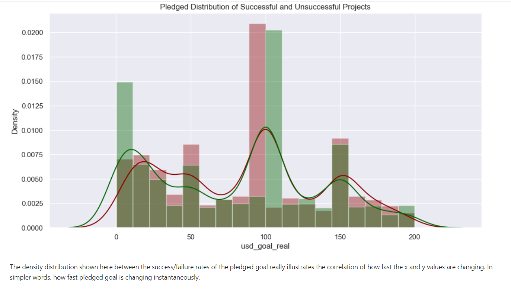
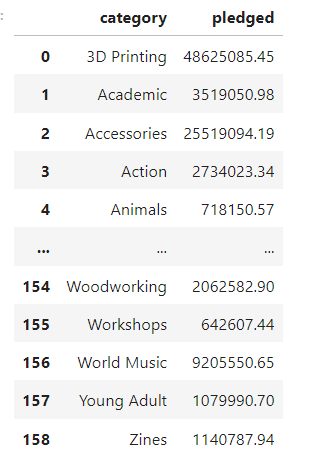

## Introduction: A short paragraph introducing your project to the audience and a motivation for why this project is important. It’s fine to say your group has an interest in this topic and were keen to explore it more.

Our group decided to analyze a dataset on 380,000 Kickstarter projects. Kickstarter is a great place for new ideas to gain traction and grow. When starting a project through Kickstarter, it would be very wise to do all in your power to make the project successful. As a group, this is what we analyzed; the goals, pledged amounts, state of the various categories/subcategories of projects/products. What makes the projects more likely to succeed, as well as some of the most successful categories. We were interested as a group in exploring these factors, not because any of us have a desire to start a kickstarter project, but for general curiosity and it being a diverse and well put together dataset.

Exploratory Data Analysis: A summary of the highlights of your EDA, where you can show some visualizations of the exploratory data analysis your group did.

## Question 1 + Results: 
Clearly state your research question, and include 2-3 visualizations that helped you answer your research question. You can create multi-panel figures, but each of your visualizations must speak directly to your research question, and any insights you were able to get from it should be clearly articulated in the figure caption/description.

## Joss' first research questions included analyzing ideal time frame between project launch and deadline, as well as the most succesful month. 
For my first questions of interest, I have 2 main categories when exploring this topic, the first exploring the importance of the month the project was released in. 

 

I started with a bar plot showcasing the succesful vs failed projects for each month.
Based on my findings, it seems as though July is the most popular month to launch a project, however it is not the most succesful and has the most fails out of any month. I suspect July is the most popular as it is the summer, meaning that people usually have more time to try something such as a startup project and they will be less likely to be limited by weather. There is a much lower project count in December, and generally most are unsuccseful. I suspect that the lower project count in December comes from the fact that the weather is generally colder, and it is an expensive time for a lot of people considering it is holiday season. The most succesful month is March, I cannot see a logical reason why however it is an interesting finding nonetheless. 

 

Another complimentary visual analyzes the average amount of money pledged per month. May is the highest with $11,233 average pledged, however the main take away once again is that December is by far the lowest. Generally, looking to avoid December when starting a project would be good practice.

The second category for this question gives a rough look into the most common times for project windows and when they are most succesful. 

This plot shows the largest spike at 30 days, which is what Kickstarter reccomened. The second biggest spike is at 60 days, which is the maximum duration. One may think that the longer the window is open, the more chance for funding, however it is quite the opposite. The lowest success rate is at 60 days, and generally everythig after 30 days steadily declines. The highest success rate is at 22 days, but anything between 10 and 30 is the most succesful. This is because it shows a sense of urgency and pledgers will feel more enticed to act fast. Generally less than 4 weeks sees more success than failures. If the deadline is months away for a project, it can be easy to simply forget about or ignore them as a backer. 

## Joss' second research question was analyzing ideal name length of project. 

The first from a scatter plot that examines the average amount pledged when looking at the length of the name was that generally between 40-60 characters is the sweet spot. Projects with a name of less than 30 generally don't recieve a lot of funing on average. This is likely due to a lack of descriptiveness. 59 characters has the highest amount pledged on average, however it is hard to just pick 59 characters and say that is the best, so anywhere in that region is generally a smart choice.

My next plot examines the name lengths of succesful, unsuccesful, and both states, giving a clearer understanding of the ideal name length. Looking at the name lengths of succesful projects, many seem to be around the 60 character mark, 20-30 also seeing steady success. Anything below 10 is generally unsuccesful. Now contrasting this with the unsuccesful plot, 60 again is the most unsuccseful name length, but there is also a very large spike in the 10-20 range, which generally seems to be too short. Looking at both of these visuals, it seems that the most popular length of name is around 60 characters. Both of these visuals show that if you are picking a name under 20 characters it is more likely to be unsuccesful. When taking into account both states, it made it easier to compare the success vs failure of certain name lengths. We can further see that the sweet spot seems to be around 40-55 charcaters (The best success to fail ratio). The worst seems to be 8-25, where there are much more fails than succesful projects.

You can [find the full analysis notebook here, including the code and data](notebooks/analysis2.ipynb)

## Question 4 + Aryan's Results: What project categories/subcategories are the most popular according to their pledged amounts and have they reached their desired goal? 

Before the details, You can [find my full analysis notebook here, including the code and data for reference](notebooks/analysis3.ipynb)

Here I was interested in analyzing different categories of the dataset especially where there have been failures and success within the goals. My analysis revolved around the research question regarding the different subcategories and categories and how they correlate with the amounts pledged; comparing both initial and deadline pledges. Moreover, which categories/projects failed or were successful based on their desired goal. I used a few visuals to illustrate and decipher the 'popular' vs 'unpopular' categories/subcategories to see which ones were failing and which ones were not. I began by choosing a few main categories and visually graphed the subcategories that were successful. For example, popular Games (main category) subcategories (tabletop games, video games, puzzles, etc). The visual clearly portrayed Tabletop games as the highest and most popular subcategory in Games with a whopping 63% project base! 

 

I used percentage lists to make it more clear to compare and contrast.

My next graph is similar to the previous graph, however, this time I analyzed the unsuccessful subcategories within the main categories based on their state. I visually illustrated using a similar plot algorithm to design the failures subdivided into 3 plots. Here I only showed one of the plots just to prove my analysis. 

 

The main category analyzed was Film and Video with a whopping failure rate subcategory Documentary of 26% above others. The second place was shorts with a 14.35%. We can also see that  fiction has a high failure rate in the category publishing, and documentaries in film/video. The reason for this could be preferences, time spent, not enough pledged amounts, and surveys. 

Overall this visual clearly demonstrated the average goal related to the projects categories states (unsuccessful/successful) and pledged amounts comparison. 

 

Another visualization is illustrated through a dist plot, but this time, the analysis is based on goals and pledges. This is crucial in understanding success/failure, as a project/category is categorized as successful if amount pledged is greater than the goal and not successful if amount pledged less than goal. Basic common sense, but more perceptible with illustrations. The density distribution shown in this visual; between the success/failure rates of the pledged goal really illustrated the correlation of how fast the x and y values were changing. In simpler words, how fast pledged goal has changed instantaneously. 

## Question 5 + Aryan's Results: What are the top 10 popular categories and how much is being pledged/awarded to these categories regardless of if they have failed or succeeded. 

This may seem similar to my previous research question, but as the analysis is explained in my EDA, there are vast differences. I analyzed the top 10 distinct categories using the count function nunique and ignoring any NaN values. I clearly separated the distinct values as that is what is needed to showcase the popular categories without any repetition. 

 This visual demonstrated this vividly. The outcome was: Out of the 159 distinct categories, Product Design was number 1 and Fashion, Fiction, Film & Video were the bottom 3. 

This makes sense as project design is essential in contributing to the success of a project or prototype. It allows for a prototype or project to reach its specific goal, thus increasing its performance. Moreover, parameters are offered to allow the project to be in tact, on time, and in budget range (pledged amounts: deadline and initial). 

Similarly, this table  presented the sum of the total amount of pledge made to the categories. This answers the research question in the sense that now we finally know how much is truly being contributed to these categories for the projects to succeed (that is what everyone wants), but not always. The amounts are insane as seen in the visual. It is showing the pledged amounts(not in order) and that 3D printing had an immense amount of pledges with a whopping 48 million dollars. This correlates with the product design category type being number 1 in the pie chart visual as prototypes or products would be made from 3D printing.

## Summary/Conclusion: A brief paragraph that highlights your key results and what you learned from doing this project.

In conclusion, the most popular length of a project is roughly 30 days, however most success can be found at 22 days. For launched projects, March has highest success rate. For projects launched in December, they face the least competition however they are generally unsuccesful. In terms of naming projects, anything below 25 characters is generally unsuccesful as it is likely not descriptive enough. The most succesful name lengths, being the ones with the best success/fail ratio are between 40-55 characters.

In conclusions, the main category with the most pledged amount was 3D printing with a value of 48 million dollars and the least was Taxidermy with only 30 thousand dollars. We also saw that more categories failed than succeeded even if the amount pledged was abundant. The result in the analysis (see EDA) was 52% failure rate and a 35% success rate for the project categories. For example, if the category/subcategory was failing, the deadline pledge was significantly lower than the initial pledge for funding the project. The most popular category was product design (3D printing). Not only that, table top games and documentary subcategories were more popular than the others according to the statistical analysis. I learned a significant amount of information regarding data analysis through doing this project. Going from knowing nothing about pandas and data wrangling/functioning, I managed to create an efficient data analysis on a data set with over 300,000 projects. I did not expect to come this far, but I managed to efficiently use my resources such as my class lectures, labs, the internet as a starting point and built on from there. I know it may not be perfect, but I have a pretty good idea of how to perform data analysis. 
